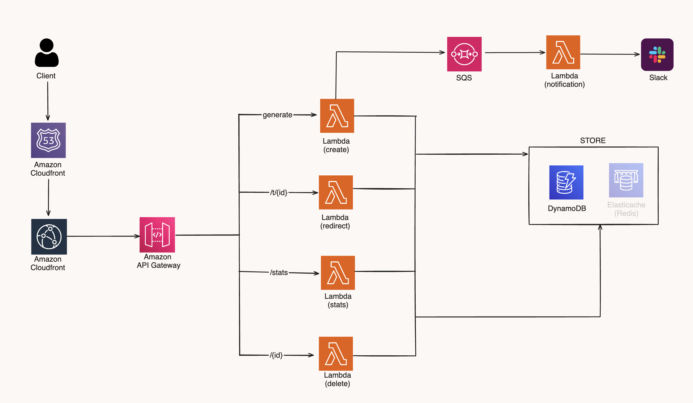
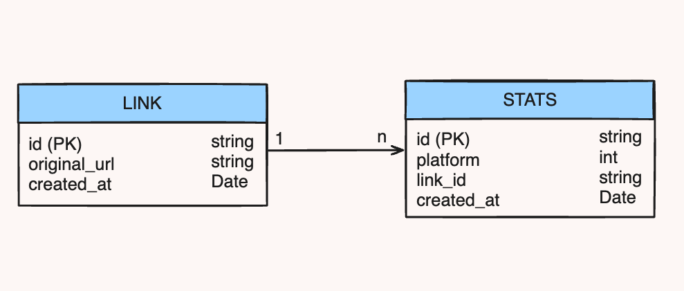
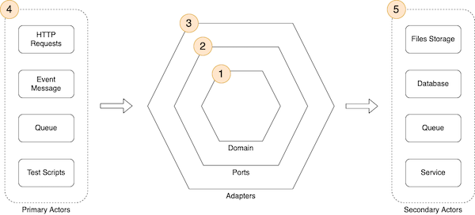

# Golang URL Shortener


This URL shortener service, built with Go and Hexagonal Architecture, leverages a serverless approach for efficient scalability and performance. It uses a variety of AWS services to provide a robust, maintainable, and highly available URL shortening service.

- [Functional Requirements](#functional-requirements)
- [Non-Functional Requirements](#non-functional-requirements)
- [Features](#features)
- [Prerequisites](#prerequisites)
- [Technologies Used](#technologies-used)
- [System Architecture](#system-architecture)
- [Class Diagram](#class-diagram)
- [Installation](#installation)
- [Usage](#usage)
  - [Deploying to AWS Lambda](#deploying-to-aws-lambda)
  - [Running Tests](#running-tests)
  - [Cleaning Up](#cleaning-up)
- [Cost Estimate](#cost-estimate)
- [Hexagonal Architecture](#hexagonal-architecture)
  - [Internal Directory](#internal-directory)
  - [Serverless and Hexagonal Architecture](#serverless-and-hexagonal-architecture)
- [Security](#security)
- [License](#license)

## Functional Requirements

- **Shortening URLs**: Users should be able to input a URL and receive a shortened version.
- **URL Redirection**: When accessing a shortened URL, users should be redirected to the original URL.
- **Analytics**: Provide analytics for each shortened URL, including click counts and basic usage stats.
- **API Access**: Offer API endpoints for creating, retrieving, and managing shortened URLs.
- **User Notifications**: Send notifications for specific actions like URL creation or deletion (Slack).

## Non-Functional Requirements

- **Scalability**: The system must automatically scale to handle varying loads.
- **Performance**: High performance in URL redirection and shortening operations.
- **Reliability**: Ensure high availability and fault tolerance.
- **Security**: Implement security measures to prevent unauthorized access and abuse.
- **Maintainability**: Code should be well-organized, documented, and adhering to Hexagonal Architecture principles for easy maintenance.
- **Monitoring and Logging**: Implement comprehensive monitoring and logging for troubleshooting and performance tracking.

## Features

- **URL Generation**: Create shortened URLs efficiently.
- **Redirection**: Redirect users to original URLs via shortened links.
- **Stats**: Gather and display usage stats of shortened URLs.
- **Notification**: Notify users or systems of certain actions or events.
- **Deletion**: Safely remove shortened URLs and their associated data.

## Prerequisites

- Go (Golang) installed on your system.
- AWS SAM CLI for deploying serverless functions.
- Access to AWS Lambda and related AWS services.

## Technologies Used

- **Go (Golang)**: The primary programming language used for development.
- **AWS DynamoDB**: A NoSQL database service used for storing and retrieving data efficiently.
- **ElastiCache(Redis)**: An in-memory data structure store, used as a cache and message broker.
- **AWS CloudFormation**: A service for defining and deploying infrastructure as code, ensuring consistent and repeatable architectural deployments.
- **AWS SQS (Simple Queue Service)**: A message queuing service used to decouple and scale microservices, distributed systems, and serverless applications.
- **GitHub Actions**: Automated CI/CD platform used for building, testing, and deploying code directly from GitHub repositories.
- **AWS Lambda**: A serverless compute service that lets you run code without provisioning or managing servers, automatically scaling with usage.
- **AWS CloudFront**: A fast content delivery network (CDN) service that securely delivers data, videos, applications, and APIs to customers globally with low latency and high transfer speeds.
- **AWS API Gateway**: A fully managed service that makes it easy for developers to create, publish, maintain, monitor, and secure APIs at any scale.

## System Architecture



## Class Diagram



## Installation

1. **Clone the Repository**:

   ```bash
   git clone [your-repository-url]
   cd golang-url-shortener
   ```

2. **Build the Project**:
   Use the Makefile to build the project:
   ```bash
   make build
   ```

## Usage

### Deploying to AWS Lambda

- Deploy your functions to AWS Lambda using the following command:
  ```bash
  make deploy
  ```
  This command will use AWS SAM to deploy your serverless functions.

### Running Tests

- **Unit Tests**:
  Run unit tests for specific functions:

  ```bash
  make unit-test
  ```

- **Benchmark Tests**:
  Perform benchmark tests:
  ```bash
  make benchmark-test
  ```

### Cleaning Up

- To clean up the build artifacts:

  ```bash
  make clean
  ```

- To delete the deployed stack:
  ```bash
  make delete
  ```

## Cost Estimate

| AWS Service         | Estimated Cost for 1 Million Requests | Notes                                                                            |
| ------------------- | ------------------------------------- | -------------------------------------------------------------------------------- |
| AWS Lambda          | $0.20                                 | First 1M requests/month are free, after that, it's $0.20 per 1 million requests  |
| API Gateway         | $3.50                                 | First 1M requests/month are free, after that, it's $3.50 per 1 million request.  |
| DynamoDB            | $1.25                                 | 2 writes per generate, 1 write per redirect, 2 reads per stats                   |
| CloudFront          | $0.75 - $2.20                         | Based on 1M HTTPS requests                                                       |
| ElastiCache (Redis) | Variable                              | Dependent on node size and time running                                          |
| SQS                 | $0.40                                 | First 1M requests/month are free, after that, it's $0.40 per 1 million requests. |

> Warning: This is a calculation based entirely on guesswork.

---

## Hexagonal Architecture



Image Resource: https://aws.amazon.com/blogs/compute/developing-evolutionary-architecture-with-aws-lambda

Hexagonal Architecture in a serverless context, specifically using Go language, is a fascinating topic that combines modern architectural patterns with the agility and scalability of serverless computing. Let's break down the key concepts and how your project structure fits into this model.

1. **Core Concept**: Hexagonal Architecture, also known as Ports and Adapters Architecture, is designed to create a loosely coupled application that isolates the core logic from external concerns. The idea is to allow an application to be equally driven by users, programs, automated tests, or batch scripts, and to be developed and tested in isolation from its eventual runtime devices and databases.

2. **Ports and Adapters**: In this architecture, the 'ports' are the interfaces that define how data can enter and leave the application or system. The 'adapters' are implementations that interact with the outside world, such as a database, a web server, or other systems.

### Internal Directory

**Adapters**:

- `cache` (e.g., `redis.go`): This likely represents the caching mechanism, an adapter to an external caching service like Redis.
- `functions`: These are serverless functions for different operations (`delete`, `generate`, `notification`, `redirect`, `stats`), each with its own `bootstrap` and `main.go`. They serve as entry points for various operations, acting as adapters to external triggers or requests.
- `handlers` (e.g., `delete.go`, `generate.go`): These are likely the controllers or use-case handlers that interact with the core domain logic.
- `repository` (e.g., `link.go`, `stats.go`): Represents the data access layer, an adapter for database interaction.

**Core Directory**:

- **Domain** (e.g., `link.go`, `stats.go`): Contains the business logic and entities of your application.
- **Ports** (e.g., `cache.go`, `link.go`): Interfaces that define the expected operations (like CRUD) for various entities.
- **Services** (e.g., `link.go`, `stats.go`): Implements business logic or domain services.

**Tests Directory**:

- Contains various tests (`benchmark`, `unit`) to ensure that both the core logic and adapters work as expected.

**Other Files**:

- `go.mod`, `go.sum`: Go module files for managing dependencies.
- `Makefile`, `README.md`: For building the project and documentation.
- `samconfig.toml`, `template.yaml`: AWS SAM configuration files for deploying serverless functions.

### Serverless and Hexagonal Architecture:

In a serverless context, Hexagonal Architecture brings several benefits:

- **Decoupling**: Your core logic is separated from external services like databases, message queues, or web frameworks.
- **Flexibility**: Easy to replace or modify external services without affecting the core logic.
- **Scalability**: Serverless functions (like AWS Lambda) can scale automatically, handling varying loads efficiently.
- **Cost-Effective**: Pay for the compute time you use, which can be more cost-effective for certain workloads.

## Security

See [CONTRIBUTING](CONTRIBUTING.md#security-issue-notifications) for more information.

## License

This library is licensed under the MIT-0 License. See the LICENSE file.
